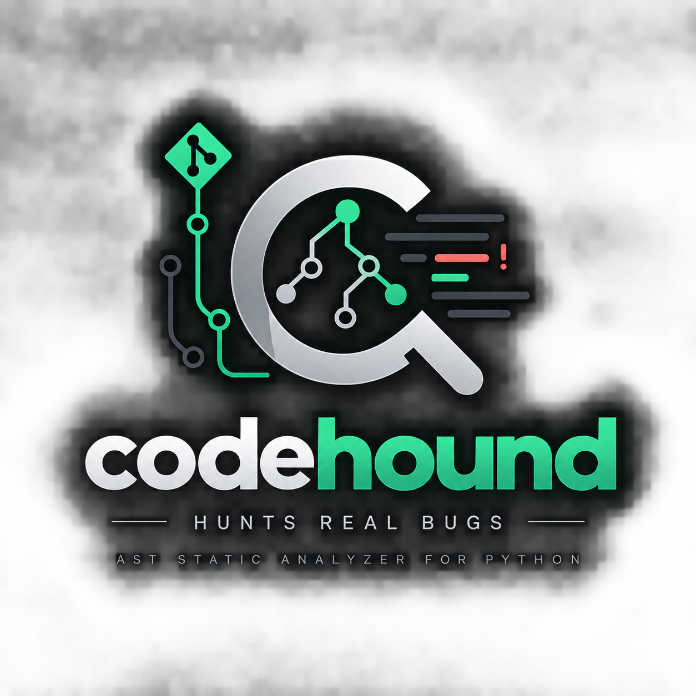

<p align="center">
  
</p>

<h1 align="center">codehound</h1>

**An AST-based static analyzer that hunts *real* bugs in large Python codebases — twenty-eight checks, eight backed by a bug that was actually found and merged (or opened as a PR) into a major open-source AI framework, the rest hardening rules verified against real false positives across a ~29-framework validation corpus instead of just reasoned about.**

[](https://github.com/kratos0718/codehound/actions/workflows/ci.yml)
[](https://pypi.org/project/codehound/)


[](https://doi.org/10.5281/zenodo.21851079)

Most linters flag style. `codehound` flags the *subtle correctness and async-safety bugs* that slip past code review and only bite in production — event-loop stalls, shared mutable state, leaked file descriptors, fire-and-forget tasks that get garbage-collected mid-run.

Most of the checks below aren't theoretical. **I wrote them after finding — and fixing, via a merged pull request — that exact bug in a real, popular framework** (agno 25k⭐, crewAI 30k⭐, mem0, llama_index, accelerate).

---

## See it in action

Pointing `codehound` at [agno](https://github.com/agno-agi/agno) (a 25k⭐ AI agent framework) surfaced real, previously-unreported bugs:

```console
$ codehound scan agno/libs/agno/agno --select CH001,CH006

agno/integrations/discord/client.py:90:26: CH001 `requests.get()` blocks the event loop
    inside async function `on_message`; use the async equivalent.
agno/tracing/exporter.py:112:16: CH006 `asyncio.create_task(...)` result is discarded;
    keep a reference (the loop only holds a weak ref, so the task may be GC'd mid-run).

Found 2 issue(s) (CH001: 1, CH006: 1)
```

**Both of these became merged/​open fixes upstream.** The first froze the Discord bot's event loop on every video/document attachment; the second could silently drop telemetry when its export task was garbage-collected mid-run. `codehound` found them in seconds — see [`docs/FINDINGS.md`](docs/FINDINGS.md) for the full provenance of every rule.

---

## Why this exists

I was contributing bug fixes to large AI frameworks and noticed the same handful of mistakes recurring across codebases. Instead of hunting them by hand, I encoded each one as an AST rule. `codehound` is the result: point it at a repo and it finds the bugs I'd otherwise have to read 100k lines to spot.

> It found the bugs behind these merged fixes — and is built to find the next one.

---

## Install

```bash
pip install codehound
```

Zero dependencies — it's ~3,200 lines on top of the standard-library `ast` module, so this installs instantly and runs fully offline, no API key or network call involved.

<details>
<summary>From a clone instead (for development)</summary>

```bash
pip install -e .

# or run straight from source, no install needed
PYTHONPATH=src python -m codehound.cli scan path/to/project
```

</details>

## Usage

```bash
# scan a project (skips tests/, docs/, examples/, vendored code by default)
codehound scan path/to/project

# scan multiple files/directories in one invocation (what pre-commit does)
codehound scan file1.py file2.py src/

# only run specific checks
codehound scan path/to/project --select CH001,CH006

# machine-readable output for CI dashboards
codehound scan path/to/project --format json
codehound scan path/to/project --format csv

# GitHub Code Scanning (Security tab) can ingest this directly
codehound scan path/to/project --format sarif > results.sarif

# list every available check
codehound list
```

`codehound scan` exits **non-zero when it finds issues**, so it drops straight into CI:

```yaml
- run: codehound scan src   # fails the build on a regression
```

### GitHub Action

```yaml
- uses: kratos0718/codehound@v1
  with:
    path: src
    # select: CH001,CH006        # optional, defaults to all checks
    # fail-on-findings: "false"  # optional, report without failing the build
    # upload-sarif: "false"      # optional, skip the Code Scanning upload
```

Uploads findings to the repo's **Security → Code Scanning** tab via SARIF, in addition to failing the step (unless `fail-on-findings: "false"`).

### pre-commit

```yaml
repos:
  - repo: https://github.com/kratos0718/codehound
    rev: v1.6.0
    hooks:
      - id: codehound
```

---

## The checks

| Code | Name | What it catches | Found in the wild |
|------|------|-----------------|-------------------|
| **CH001** | `blocking-call-in-async` | A synchronous blocking call (`time.sleep`, `requests.*`, `subprocess.*`) inside an `async def` — it freezes the **entire** event loop, stalling every other coroutine. | agno Couchbase vector store (`time.sleep` in an `async` collection-overwrite path) |
| **CH002** | `mutable-default-argument` | `def f(x=[])` — the default is created once and shared across every call, silently leaking state. (flake8-bugbear B006) | agno toolkits; mem0 proxy & embedder configs |
| **CH003** | `deprecated-datetime-utcnow` | `datetime.utcnow()` / `utcfromtimestamp()` — deprecated since 3.12, returns a naive datetime that lies about its timezone. | crewAI memory subsystem (9 sites, 4 files) |
| **CH004** | `deprecated-get-event-loop` | `asyncio.get_event_loop()` outside a running loop — deprecated since 3.10. | crewAI structured-tool / Snowflake search tool |
| **CH005** | `unclosed-file-handle` | `f = open(...)` with no `with` and no matching `.close()` — leaks descriptors until `RLIMIT_NOFILE` is exhausted. | agno `OpenAITools.transcribe_audio` |
| **CH006** | `floating-task` | `asyncio.create_task(...)` whose result is discarded — the loop keeps only a *weak* reference, so the task can be GC'd before it finishes. (Ruff RUF006) | hardening rule — the most under-caught async bug |
| **CH007** | `unawaited-coroutine-call` | `foo()` where `foo` is `async def`, called as a bare statement — no `await`, no scheduling. The coroutine object is created and dropped; the body **never runs at all**. | hardening rule — see below |
| **CH008** | `asyncio-run-in-running-loop` | `asyncio.run(...)` called from inside an `async def` — always raises `RuntimeError`, immediately, every time. | hardening rule — zero corpus hits (see below) |
| **CH009** | `floating-thread` | A non-daemon `threading.Thread` that's `.start()`ed but never `.join()`ed — the thread analog of CH006. | hardening rule — see below |
| **CH010** | `loop-closure-capture` | A `lambda` inside a `for` loop (or comprehension) that's *stored* (appended, assigned, returned) and captures the loop variable by reference — every stored instance ends up sharing the loop's **final** value. | **accelerate** (HuggingFace) — `MegatronEngine.get_module_config`'s `param_sync_func` list, PR #4273 |
| **CH011** | `lru-cache-on-method` | `@lru_cache`/`@cache` decorating an instance method — the cache holds a strong reference to `self` forever, so every instance that ever calls the method leaks for the process lifetime. | **optuna** — `_FanovaTree`'s node-lookup methods leaked every tree built for a `get_param_importances()` call; **llama_index** — `VectaraIndex._get_corpus_key` leaked the index *and* broke its own `__del__`-based HTTP session cleanup; **litellm** — `Router._cached_get_model_group_info` leaked every `Router` even after its own documented `discard()` cleanup |
| **CH012** | `floating-process` | A non-daemon `multiprocessing.Process` that's `.start()`ed but never `.join()`ed — the process analog of CH009. | hardening rule |
| **CH013** | `discarded-future` | `ThreadPoolExecutor`/`ProcessPoolExecutor.submit(...)` called as a bare statement — the returned `Future` (and any exception raised inside the submitted work) is silently discarded. | hardening rule — real hits in litellm, accelerate, langchain |
| **CH014** | `unprotected-lock-acquire` | `lock.acquire()` outside a `with`, whose matching `.release()` isn't inside a `finally:` — an exception between acquire and release deadlocks every future caller of that lock. | hardening rule — real hits in vllm, accelerate, torchtune |
| **CH015** | `async-property` | `@property`/`@cached_property` wrapping an `async def` — accessing the attribute hands back an un-awaited coroutine object, not the value. | hardening rule |
| **CH016** | `unclosed-socket` | `socket.socket(...)` stored without a context manager or matching `.close()` — the socket analog of CH005; leaks the file descriptor. | hardening rule |
| **CH017** | `collections-abc-import` | `from collections import Mapping` (or `Sequence`, `Iterable`, …) — the ABCs were removed from `collections` itself in Python 3.10; they live in `collections.abc`. | hardening rule |
| **CH018** | `removed-asyncio-task-methods` | `asyncio.Task.current_task()` / `.all_tasks()` — both removed in Python 3.9; use `asyncio.current_task()` / `asyncio.all_tasks()`. | hardening rule |
| **CH019** | `removed-getargspec` | `inspect.getargspec(...)` — removed in Python 3.11 after a decade-plus deprecation; use `inspect.signature(...)`. | hardening rule |
| **CH020** | `bare-except` | A bare `except:` (or unused `except BaseException:`) — also catches `KeyboardInterrupt`/`SystemExit`, so Ctrl-C stops working and `sys.exit()` gets silently absorbed. | hardening rule — real hits in agno, llama_index, marimo, litellm |
| **CH021** | `removed-stdlib-module` | `import distutils` (removed 3.12) or any of the 19 PEP 594 "dead battery" modules (`cgi`, `imghdr`, `telnetlib`, `nntplib`, …, removed 3.13) — `ImportError` the moment the module loads. | hardening rule — real hit in agno (already guarded, see below) |
| **CH022** | `removed-asyncio-coroutine-decorator` | `@asyncio.coroutine` — removed in Python 3.11 after a generator-based-coroutine bridge that predates `async def`; `AttributeError` the moment the decorator line runs. | hardening rule |
| **CH023** | `removed-stdlib-attribute` | A specific removed function on a module that still imports fine — `time.clock()` (3.8), `platform.linux_distribution()`/`.dist()` (3.8), `cgi.escape()` (3.8), `base64.encodestring()`/`.decodestring()` (3.9). | hardening rule — real hit in scikit-learn |
| **CH024** | `unittest-deprecated-alias` | `self.assertEquals(...)`/`self.failUnless(...)` and a dozen other legacy `unittest.TestCase` aliases — removed in Python 3.12. | hardening rule |
| **CH025** | `is-literal-comparison` | `x is 1000` / `x is not "foo"` — `is` checks identity, not equality; relies on CPython's small-int caching / string interning, neither guaranteed. (pyflakes F632) | hardening rule — real false positive fixed in litellm's own code, see below |
| **CH026** | `mutable-class-attribute` | `class C: items = []` mutated via `self.items.append(...)` without ever being reassigned per instance — every instance shares and mutates the *same* list. | **vllm**, **llama_index**, **optuna**, **transformers** — see below |
| **CH027** | `unwaited-subprocess` | `subprocess.Popen(...)` never `.wait()`ed/`.communicate()`d with, and not context-managed — risks a zombie process and a full pipe buffer deadlocking the child. | hardening rule — real hit in dspy (already handled, see below) |
| **CH028** | `floating-timer` | `threading.Timer(...)` started but never `.cancel()`ed or handed off — nothing can stop the callback from firing later, on stale context. | hardening rule — real hits in marimo, transformers |

`codehound list` prints this from the source of truth.

CH007-CH028 don't have found-and-merged bugs behind all of them the way
CH001-CH006 do - most are hardening rules for well-known Python
correctness gotchas rather than something this project personally
tracked down first. CH010 and CH011 are the exceptions: both found
genuine bugs on their own, in HuggingFace's `accelerate`, optuna, and
llama_index - see below. Building CH007-CH010 surfaced real false
positives, each one fixed before shipping:

- **CH007** (agno): a bare `self.foo()` call matched against an unrelated
  same-named `async def foo` on a *different* class (agno's own
  sync/async "twin method" convention, e.g. `ZepTools`/`ZepAsyncTools`),
  and a plain callable parameter shadowed by an unrelated same-named
  async function hundreds of lines away in the same file.
- **CH009** (llama_index): a thread handed off through a *different*
  object's attribute, not `self` - `chat_response.write_response_to_history_thread
  = thread`, with `chat_response` itself returned and the thread joined
  later once the caller finishes consuming the stream.
- **CH010** (marimo): `sorted(rows, key=lambda row: row[sort_arg.by])`
  inside `for sort_arg in ...` - the lambda references the loop variable,
  but `sorted()` calls it *immediately*, synchronously, before the next
  iteration moves `sort_arg` on. Nothing outlives the iteration. This
  reshaped the check entirely: it now only fires when a lambda is
  directly *stored* (`.append(...)`, assignment, `return`), not merely
  passed as a callback argument to something that consumes it on the spot.

**The `accelerate` find (CH010):** `MegatronEngine.get_module_config`
builds one callback per model chunk for distributed-training parameter
sync: `[lambda x: self.optimizer.finish_param_sync(model_index, x) for
model_index in range(len(self.module))]`. Every lambda captures
`model_index` by reference; by the time any of them actually runs, the
comprehension has finished and `model_index` holds its final value for
*all* of them - whichever chunk's callback fires, it reports the
*last* chunk's index. Fixed with the standard default-argument capture
(`model_index=model_index`) and a regression test that fails on the
pre-fix code (all three callbacks report index 2) and passes on the fix.
PR: [huggingface/accelerate#4273](https://github.com/huggingface/accelerate/pull/4273).

Scanning ~20 major Python AI/ML frameworks with the fixed CH007/CH008/CH009
turned up zero further real instances beyond the ones above - itself a
result, not a null: CH008's bug fails immediately and unconditionally, so
it's very unlikely to survive basic testing; CH007 and CH009 both only
match same-file names by design, and most real cases of either are
plausibly cross-module.

**The optuna, llama_index, and litellm finds (CH011):** all three are
`@lru_cache(maxsize=None)` (or a fixed `maxsize`) decorating an instance
method - a strong reference to `self` retained for the life of the
process. In optuna, `_FanovaTree`'s node-lookup methods leak every tree
built for a `get_param_importances()` call (one per random-forest
estimator). In llama_index, `VectaraIndex._get_corpus_key` leaks the
index itself - and since `VectaraIndex.__del__` exists specifically to
close the index's `requests.Session` on garbage collection, the leak
silently disables that cleanup too, so an HTTP session leaks along with
every index. In litellm, `Router._cached_get_model_group_info` leaks
every `Router` that's ever served a request through it - proved this
survives even a correctly-called `router.discard()` (Router's own
documented cleanup method), so it isn't a "you forgot to clean up" bug.
All three fixed the same way: move the cache from a class-level decorator
to a per-instance one built in `__init__`, so it's freed with the
instance instead of outliving it - the exact pattern litellm's own
`cached_deployment_model_info` sibling method already used, just not yet
applied to this one. Each has a regression test verified to fail pre-fix
and pass post-fix.
PRs: [optuna/optuna#6859](https://github.com/optuna/optuna/pull/6859),
[run-llama/llama_index#23089](https://github.com/run-llama/llama_index/pull/23089),
[BerriAI/litellm#41582](https://github.com/BerriAI/litellm/pull/41582).

**A third CH011 shape needed a guard instead of a PR:** dspy's `Image` (a
pydantic model) caches `format()` the same way, but `Image` is frozen
(`model_config = ConfigDict(frozen=True)`), which makes it hashable and
equal *by field value*, not identity. Checked directly rather than
assumed: two separately constructed instances with equal fields hash
equal, and the second one's call is served from the first's cache entry
without ever being inserted itself — bounded, value-based memoization,
not a leak. CH011 now recognizes a frozen `@dataclass` or a frozen
pydantic model and skips it.

**CH016 found and fixed its own false positive the day it shipped.** The
first real-corpus scan of `unclosed-socket` turned up three hits in
vllm's distributed process-group rendezvous code - all three sockets were
actually handed off correctly (returned inside a tuple, collected into a
list that's itself returned, passed as an argument into a function that
takes ownership), just not in a shape CH005 (the check this one was
modeled on) ever needed to recognize, since files aren't handed off this
way nearly as often as rendezvous sockets are. Fixed by treating a name
as escaped when it's returned as part of a tuple/list or passed as an
argument to any call. A full corpus rescan afterward found zero remaining
CH016 hits.

**CH021 did the same thing twice, minutes apart.** The first real-corpus
scan found a false positive in vllm - `from .chunk import
chunk_gated_delta_rule`, a relative import of vllm's own local `chunk.py`
sibling module, not the removed stdlib `chunk`. `ast.ImportFrom.module`
is `"chunk"` either way; only `node.level` (the leading-dot count) tells
a relative import apart from an absolute one, and the check wasn't
checking it. Fixed, rescanned, and found a *second* false positive in
agno: `try: import imghdr except ImportError: import filetype` - a
real, deliberate fallback that already anticipates this exact removal,
not a bug waiting to happen. Added a second guard: skip an import inside
a `try:` body whose `except` catches `ImportError` (or anything
broader). A full corpus rescan after both fixes found zero remaining
CH021 hits.

**CH026 found four real, previously-unreported bugs on its first real
scan.** All four are the exact same shape: a class-level mutable default
(`items = []`) mutated in place via `self.items.append(...)` (or
subscript assignment) with no per-instance reassignment anywhere, so
every instance of the class shares and corrupts the *same* object. In
vllm's `AXK1ForCausalLM`, `self.packed_modules_mapping["qkv_proj"] =
[...]` patches a routing table shared by every instance of the model
class. In llama_index's `ZapierToolSpec`, `self.spec_functions.append(...)`
means a second tool-spec instance (a different API key, a different
user) inherits every action name the first instance ever registered. In
optuna's CLI `_Studies` command, `self._study_list_header.append(...)`
does the same to a table-header list. In HuggingFace transformers'
`CodeGenTokenizer`, `self.model_input_names.append("token_type_ids")`
means constructing one tokenizer with `return_token_type_ids=True`
silently changes what field every *other* `CodeGenTokenizer` instance in
the same process expects, regardless of how it was configured - exactly
the "spooky action at a distance" class of bug this project exists to
catch. None have PRs yet: vllm and transformers both require AI-assisted
PRs to carry an explicit disclosure, which this project's own policy
doesn't do, so those two are documented here rather than filed.

**CH028 hit the exact same name-collision problem CH018/CH022 already
had a guard for, because that guard didn't get reused.** The very first
corpus scan came back with ~30 hits, almost all in agno - which doesn't
use `threading.Timer` at all. `from agno.utils.timer import Timer` is
agno's own unrelated stopwatch class, called as `Timer()` with zero
arguments (real `threading.Timer` requires `interval` and `function` and
would raise `TypeError` immediately). Fixed by requiring `from threading
import Timer` before trusting a bare `Timer(...)` call - the same guard
already built for CH022's `coroutine` minutes earlier in the same
session, just not applied here the first time. Also missed CH009's
`daemon=True` escape entirely (found in weaviate-python-client's
watchdog timer, `_timeout_timer.daemon = True`, a deliberate
"outlive the caller" choice) - added both a constructor-kwarg and a
post-construction-assignment check for it, matching CH009 exactly. Real
hits remain in marimo (a non-daemon browser-opening timer, never
cancelled) and transformers (a chained, never-captured checkpoint-retry
timer).

**CH025 and CH027 each found one real bug in the first scan, and one
real gap in the check.** CH025 (is-literal-comparison) flagged litellm's
`if "usage" in response_obj is not None:` - but for the wrong reason.
`ast.Compare` puts every operand and every op from a chained comparison
in one node; checking "is there a literal anywhere" and "is there an
`is`/`is not` anywhere" independently, without pairing each op with its
own adjacent operands, matched the string literal (paired with `in`)
against the wrong op (`is not`, actually comparing `response_obj` to the
allowed singleton `None`). Fixed by walking the chain as adjacent
`(left, op, right)` triples. CH027 (unwaited-subprocess) flagged dspy's
`process = subprocess.Popen(...)`, followed by `lm.process = process` -
a real hand-off to a different object, reaped later through a separate
`terminate_process(lm.process)` call, the same "stored as any object's
attribute" escape CH009/CH016/CH028 already needed. Added it.

**Two checks we built and did not ship.** `exception-chaining` (`except X
as e: raise Y(...)` with no `from e`, discarding the real traceback -
overlaps flake8-bugbear B904) worked exactly as designed, but at a scale
that says more about how common the pattern is than about anything worth
flagging: **1,911 hits across the same ~20-framework corpus**. Shipping a
check that fires that often would make every scan result mostly noise,
undermining the "a finding must be defensible" standard the rest of this
tool holds itself to.

`cancelled-error-swallowed` (`except asyncio.CancelledError: pass` -
premise: silently swallowing task cancellation is a bug) went further
than volume alone: the **first two real hits checked**, in two different
frameworks, were both correct code, not bugs. agno's was `existing_task.
cancel(); try: await existing_task; except CancelledError: pass` - the
textbook-correct way to await a task's own cancellation. letta's was an
explicit, logged recovery path (`except (CancelledError, ...) as e: logger
.info(...); <continue processing>`) with a comment literally saying it was
overriding the cancellation on purpose. Unlike the exception-chaining
volume problem, this one meant the check's core premise was false in a
large fraction of real occurrences - so it was deleted outright rather
than kept at a lower confidence tier. Both are: built, measured, and
deliberately left out - a real decision, not an oversight.

---

## How it works

```
codehound/
├── core.py          # file discovery, AST parsing, the Finding/Check contract,
│                    #   and a child→parent map so checks can ask "what's my
│                    #   enclosing function / am I inside a `with`?"
├── cli.py           # `scan` / `list`, text|json|csv|sarif output, CI-friendly exit codes
├── sarif.py         # SARIF 2.1.0 output for GitHub Code Scanning
├── terminal.py      # colored text output (auto-disabled for non-TTY / NO_COLOR)
└── checks/          # one small, independently-tested class per rule
    ├── blocking_async.py     (CH001)
    ├── mutable_defaults.py   (CH002)
    ├── datetime_utcnow.py    (CH003)
    ├── get_event_loop.py     (CH004)
    ├── resource_leak.py      (CH005)
    ├── floating_task.py      (CH006)
    ├── unawaited_coroutine.py (CH007)
    ├── asyncio_run_in_loop.py (CH008)
    ├── floating_thread.py     (CH009)
    ├── loop_closure_capture.py (CH010)
    ├── lru_cache_on_method.py  (CH011)
    ├── floating_process.py     (CH012)
    ├── discarded_future.py     (CH013)
    ├── unprotected_lock.py     (CH014)
    ├── async_property.py       (CH015)
    ├── unclosed_socket.py      (CH016)
    ├── collections_abc_import.py (CH017)
    ├── removed_asyncio_task_methods.py (CH018)
    ├── removed_getargspec.py   (CH019)
    ├── bare_except.py          (CH020)
    ├── removed_stdlib_module.py (CH021)
    ├── asyncio_coroutine_decorator.py (CH022)
    ├── removed_stdlib_attribute.py (CH023)
    ├── unittest_deprecated_alias.py (CH024)
    ├── is_literal_comparison.py (CH025)
    ├── mutable_class_attribute.py (CH026)
    ├── unwaited_subprocess.py  (CH027)
    └── floating_timer.py       (CH028)
```

Each check receives a parsed `ast` tree plus the precomputed parent map and returns `Finding`s. Adding a rule is one file + one registry line + a test. See [`docs/ARCHITECTURE.md`](docs/ARCHITECTURE.md) for a full walkthrough of the engine, the parent map, and the design decisions.

**False-positive discipline is a feature.** CH005 won't flag a handle that's `return`ed (the caller owns it) or explicitly `.close()`d. CH006 won't flag `TaskGroup.create_task` (the group holds the reference). CH001 only fires when the *enclosing* function is `async`. CH007 scopes `self.foo()` matches to async methods on the *same* class as the call site, and bare `foo()` matches to module-level async functions that aren't shadowed by a same-named parameter. CH009 doesn't flag a thread handed off as *any* object's attribute, not just `self`. CH010 only fires when a lambda is directly stored (appended, assigned, returned), not merely passed as a callback argument that gets consumed on the spot. CH016 doesn't flag a socket returned as part of a tuple/list, or passed as an argument to any call (as opposed to being the receiver of a call on itself) — real patterns found in vllm's rendezvous code. CH020 won't flag a `BaseException` handler whose bound name is actually referenced, or whose body re-raises anywhere in its own scope (not counting a nested try/except's own handler) — both real patterns found in agno. CH021 doesn't flag a relative import (`node.level != 0`) of a same-named local module, or an import already inside a `try:`/`except ImportError:` fallback — real patterns found in vllm and agno respectively. CH025 pairs each chained comparison's op with only its own adjacent operands, rather than matching a literal and an `is`/`is not` anywhere in the same chain independently — a real pattern found in litellm. CH027 and CH028 both recognize a handle stored as *any* object's attribute as a hand-off, matching CH009/CH016's precedent — real patterns found in dspy and weaviate-python-client respectively. CH028 also only trusts a bare `Timer(...)` when `from threading import Timer` was actually seen — real hits in agno were its own unrelated stopwatch class. All of those guards exist because of real false positives caught while building the checks (see above and [`docs/FINDINGS.md`](docs/FINDINGS.md)). The test suite asserts both "bad code is flagged" and "correct code is not."

---

## Tests

```bash
pip install -e ".[dev]"
pytest -q
```

Every check has paired tests: the buggy pattern *is* flagged, and the idiomatic fix is *not*.

---

## Roadmap

- [x] `await` on a non-awaited coroutine (missing-await detection) — CH007
- [x] PyPI release — `pip install codehound`
- [x] `asyncio.run()` inside a running loop — CH008
- [x] Non-daemon thread started without a join — CH009 (the thread analog of CH006)
- [x] Loop-variable closure capture in lambdas — CH010
- [x] Pre-commit hook — `.pre-commit-hooks.yaml`
- [x] GitHub Action — `action.yml`, uploads SARIF to Code Scanning
- [x] SARIF output — `--format sarif`
- [x] Colored terminal output (auto-disabled for non-TTY / `NO_COLOR`)
- [x] Multi-path `scan` invocation (what the pre-commit hook needs)
- [x] 20 checks — memory leaks (`lru_cache` on methods), floating processes,
      discarded futures, unprotected locks, async properties, unclosed
      sockets, removed-in-3.9/3.10/3.11 stdlib APIs, bare `except:` — CH011-CH020
- [x] 22 checks — removed stdlib modules (`distutils`, PEP 594 "dead
      batteries"), removed `@asyncio.coroutine` decorator — CH021-CH022
- [x] 28 checks — removed stdlib functions, deprecated unittest aliases,
      `is`-literal comparisons, mutable class attributes, unwaited
      subprocesses, floating timers — CH023-CH028
- [ ] Cross-module resolution for CH007/CH009 (currently same-file only)
- [ ] Sync HTTP clients constructed inside async request handlers
- [ ] `--fix` for the mechanical rules (CH002, CH003, CH004)

---

## License

MIT © Abhinav Tarigoppula
