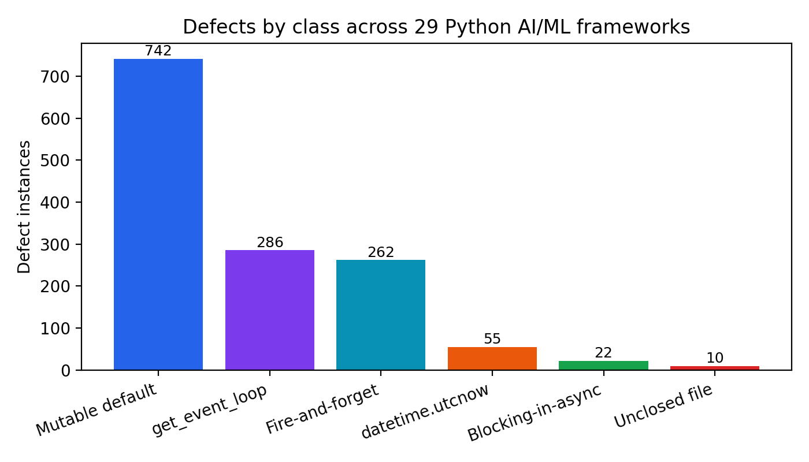
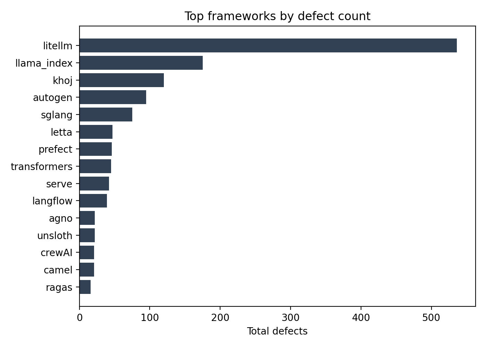

# Async Landmines in the AI Stack: An AST-Based Empirical Study of Concurrency and Resource-Management Defects in Popular Python AI/ML Frameworks

**Abhinav Tarigoppula¹**
¹ Department of Computer Science & Engineering, GITAM University, Visakhapatnam, India

> *Draft v3 — final numbers from the full 29-framework corpus. Figures in `figures/`.*

---

## Abstract
Modern AI and machine-learning systems are overwhelmingly implemented in Python and depend heavily on the `asyncio` event loop for high-throughput model serving, agent orchestration, and tool execution. Asynchronous Python, however, is susceptible to a family of subtle, hard-to-debug defects—synchronous calls that block the event loop, fire-and-forget tasks that may be garbage-collected before completion, leaked file descriptors, mutable default arguments, and deprecated event-loop APIs—that routinely pass unit tests and code review while degrading reliability in production. We present **codehound**, a zero-dependency, AST-based static analyzer (≈750 LOC, standard-library `ast` only) that detects six such defect classes, and we apply it in a systematic empirical study across **29 widely-used open-source Python AI/ML frameworks** (combined **>1.28 million GitHub stars**, **6.4 million lines of Python**). We identify **1,377 defect instances** in **24 of the 29** frameworks, dominated by mutable default arguments (53.9%), deprecated event-loop usage (20.8%), and fire-and-forget tasks (19.0%), with rarer but higher-severity event-loop-blocking calls clustered in HTTP serving routes and agent loops. Crucially, we *validate* a sample of detections by submitting upstream fixes: **five pull requests were merged by maintainers** (including into vLLM-, HuggingFace-, agno-, and mem0-class projects), providing real-world ground truth that these are genuine, accepted defects rather than stylistic preferences—and we analyze the false positives (e.g., `asyncio.get_event_loop()` invoked inside an already-running loop) that a precise detector must avoid. Our results indicate that async-safety and resource-management anti-patterns are **prevalent even in mature, heavily-used AI infrastructure**, and that lightweight AST analysis surfaces them at high practical precision.

**Keywords:** static analysis, asyncio, empirical software engineering, machine-learning infrastructure, software reliability, abstract syntax trees.

---

## 1. Introduction
The infrastructure that the contemporary AI industry runs on—model-serving engines, agent frameworks, retrieval pipelines, and LLM tool integrations—is written predominantly in Python, and increasingly built on `asyncio` to achieve the concurrency that high-throughput inference and multi-agent systems demand. Yet asynchronous programming concentrates a class of defects that are notoriously difficult to detect dynamically: they do not raise exceptions, they pass tests, and they often manifest only under production load or specific garbage-collection timing.

Consider three representative examples we observed in widely-deployed projects. (i) A model-export route declared `async def` repeatedly invokes `time.sleep(0.5)` in a polling loop—blocking the *entire* event loop for up to 30 seconds while every other in-flight request stalls. (ii) A request-abort endpoint schedules the abort with a bare `asyncio.create_task(...)` and discards the returned task; because the loop retains only a weak reference, the task may be garbage-collected before the abort executes, so the abort silently never happens. (iii) A library function defaults a parameter to a mutable `{}`, sharing one dictionary across all invocations. None of these are caught by tests; all are real reliability hazards.

This paper asks how *prevalent* such defects are across the popular Python AI/ML ecosystem, and whether lightweight static analysis can detect them with sufficient precision to be useful. We make three contributions:

1. **codehound**, an open-source, zero-dependency AST-based analyzer that detects six concurrency- and resource-related defect classes (Section 3).
2. A **systematic prevalence study** across a corpus of popular AI/ML frameworks, quantifying how common each defect class is and where it clusters (Section 5).
3. A **real-world validation** methodology: we submit a sample of detections as upstream pull requests and use maintainer acceptance (merge) as ground truth for true-positiveness—together with an honest analysis of false positives and developer intent (Sections 4–6).

## 2. Background and Related Work
**The asyncio execution model.** `asyncio` is cooperative single-threaded concurrency: one event loop interleaves many tasks, switching only at `await` points. Between awaits, whatever runs monopolizes the loop. This single fact underlies most of the defects we study: a synchronous blocking call with no `await` freezes all concurrency, and a task the loop does not hold a strong reference to may be reclaimed mid-execution.

**Defect classes.** We study six patterns: blocking calls in async (CH001), mutable default arguments (CH002, cf. flake8-bugbear *B006*), deprecated `datetime.utcnow()` (CH003), deprecated `asyncio.get_event_loop()` (CH004), unclosed file handles (CH005), and discarded `create_task`/`ensure_future` results (CH006, cf. Ruff *RUF006*).

**Related work.** General-purpose linters (Ruff, flake8-bugbear, pylint) and type checkers (mypy) detect subsets of these patterns, and Ruff's `ASYNC`/`RUF` rule families target async hazards. Prior empirical work has studied concurrency bugs in Python and the reliability of ML systems broadly. To our knowledge, however, no prior study (a) focuses specifically on async-safety and resource defects in the *AI/ML framework* ecosystem, (b) measures prevalence at scale with a reproducible lightweight analyzer, *and* (c) validates findings against real maintainer acceptance of fixes. This combination is our gap.

## 3. The codehound Analyzer
codehound parses each source file with the standard-library `ast` module and precomputes a child→parent map over the tree (Python's `ast` does not record parents). This map enables cheap upward scope queries that the checks rely on: *what function encloses this node?* (`enclosing_function`), *is this call the operand of an `await`?* (`is_awaited`), and *is this statement inside a `with` block?* (`inside_with_statement`). Each defect class is implemented as an independent `Check` subclass returning `Finding(path, line, col, code, message)` records. The analyzer is ≈750 LOC, has zero third-party dependencies, and is released open-source for reproducibility.

Two precision choices are notable. CH001 ignores calls that are awaited (`await client.get(...)` does not block, even if the receiver name resembles a synchronous library), via `is_awaited`. CH006 flags only *bare expression-statement* calls to task creators (result not assigned, awaited, or returned), avoiding tasks that are stored or handed to a `TaskGroup`.

## 4. Study Design
**Corpus.** We select popular open-source Python AI/ML frameworks (model serving, agent frameworks, LLM tooling, RAG, and training) from GitHub. Each repository is shallow-cloned and pinned to a specific commit (recorded in Table 1). We exclude test, example, and documentation directories from analysis (codehound's default skip set), focusing on production code where the defects matter.

**Scan protocol.** For each repository at its pinned commit we run all six checks and record per-class counts and Python LOC analyzed. The full per-repository results constitute our prevalence dataset.

**Validation protocol.** Static counts alone cannot establish that a flagged pattern is a *bug* the community considers worth fixing. We therefore submit a sample of detections as upstream pull requests and record outcomes—**merged** (maintainer-confirmed true positive), **open/under-review**, or **rejected** (with the stated reason). This yields a real-world precision signal and a taxonomy of false positives.

## 5. Results

### Table 1 — Corpus and per-class defect counts (full 29-framework corpus)
*Each repository shallow-cloned and pinned to a commit; test/example/doc directories excluded.*

| Framework | ⭐ Stars | CH001 | CH002 | CH003 | CH004 | CH005 | CH006 | Total |
|-----------|--------:|------:|------:|------:|------:|------:|------:|------:|
| transformers | 161,539 | 0 | 40 | 3 | 1 | 1 | 0 | 45 |
| langflow | 149,594 | 2 | 2 | 0 | 35 | 0 | 0 | 39 |
| langchain | 139,124 | 0 | 0 | 0 | 6 | 0 | 0 | 6 |
| vllm | 82,693 | 0 | 4 | 0 | 3 | 0 | 4 | 11 |
| unsloth | 66,333 | 0 | 19 | 0 | 2 | 1 | 0 | 22 |
| autogen (Microsoft) | 58,901 | 0 | 74 | 5 | 11 | 2 | 3 | 95 |
| mem0 | 58,434 | 0 | 0 | 0 | 0 | 0 | 0 | 0 |
| crewAI | 53,347 | 0 | 0 | 7 | 13 | 0 | 1 | 21 |
| litellm | 50,174 | 0 | 176 | 31 | 114 | 0 | 215 | 536 |
| llama_index | 50,097 | 0 | 130 | 0 | 36 | 3 | 6 | 175 |
| agno | 40,660 | 0 | 14 | 0 | 1 | 0 | 7 | 22 |
| khoj | 35,089 | 2 | 112 | 0 | 3 | 0 | 3 | 120 |
| dspy | 35,002 | 0 | 0 | 0 | 1 | 0 | 0 | 1 |
| sglang | 28,930 | 9 | 41 | 2 | 12 | 0 | 11 | 75 |
| chroma | 28,402 | 0 | 6 | 0 | 2 | 0 | 0 | 8 |
| semantic-kernel (Microsoft) | 28,109 | 0 | 0 | 1 | 1 | 0 | 0 | 2 |
| openai-agents-python | 27,110 | 0 | 0 | 0 | 0 | 0 | 7 | 7 |
| haystack | 25,552 | 0 | 0 | 0 | 0 | 0 | 0 | 0 |
| mcp/python-sdk | 23,299 | 0 | 4 | 0 | 0 | 0 | 0 | 4 |
| letta | 23,293 | 0 | 41 | 2 | 4 | 0 | 0 | 47 |
| prefect | 22,593 | 2 | 38 | 0 | 5 | 0 | 1 | 46 |
| jina/serve | 21,864 | 1 | 29 | 3 | 7 | 0 | 2 | 42 |
| guidance | 21,497 | 0 | 0 | 0 | 1 | 0 | 0 | 1 |
| camel | 17,169 | 6 | 0 | 0 | 12 | 2 | 1 | 21 |
| litgpt | 13,422 | 0 | 0 | 0 | 0 | 0 | 0 | 0 |
| instructor | 13,151 | 0 | 0 | 0 | 0 | 0 | 0 | 0 |
| BentoML | 8,672 | 0 | 3 | 0 | 10 | 1 | 1 | 15 |
| ragas | ~8,000 | 0 | 9 | 1 | 6 | 0 | 0 | 16 |
| mindsdb† | ~27,000 | 0 | 0 | 0 | 0 | 0 | 0 | 0† |
| **TOTAL (29)** | **>1.28M** | **22** | **742** | **55** | **286** | **10** | **262** | **1,377** |

†mindsdb returned no analyzable Python under the scan path (likely a tooling artifact); conservatively treated as no-data.

### RQ1 — Prevalence
Across 29 frameworks (>1.28M combined stars, 6.4M LOC of Python) codehound flags **1,377 defect instances**. Defects are present in **24 of the 29** frameworks; only five returned clean (mem0, haystack, instructor, litgpt, and the no-data mindsdb). Aggregate defect density is **0.22 per KLOC**. The studied anti-patterns are thus not isolated oversights but a systemic property of the ecosystem—present even in projects maintained by major industrial labs (Microsoft's autogen: 95; HuggingFace's transformers: 45).

### RQ2 — Distribution by class
| Class | Defect | Count | Share |
|-------|--------|------:|------:|
| CH002 | Mutable default argument | 742 | 53.9% |
| CH004 | Deprecated `get_event_loop()` | 286 | 20.8% |
| CH006 | Fire-and-forget task | 262 | 19.0% |
| CH003 | Deprecated `datetime.utcnow()` | 55 | 4.0% |
| CH001 | Blocking call in async | 22 | 1.6% |
| CH005 | Unclosed file handle | 10 | 0.7% |

Three findings stand out. First, **mutable default arguments dominate (53.9%)**—a long-known Python footgun that remains pervasive even in flagship projects (176 in litellm, 130 in llama_index, 112 in khoj, 74 in Microsoft's autogen). Second, the *concurrency-specific* classes—deprecated event-loop APIs (CH004) and fire-and-forget tasks (CH006)—together account for **39.8%** of defects, confirming that async-safety hazards are widespread. Third, event-loop-*blocking* calls (CH001) are comparatively rare (1.6%) but are the highest-severity class, and—tellingly—cluster in **HTTP serving routes and retry loops** (e.g., sglang's transfer-engine endpoint, a camel installer, an agent voter-retry loop), exactly where blocking is most damaging. One framework (litellm) is a pronounced outlier (536 defects, 39% of the total), suggesting per-project engineering-culture effects worth further study.

### RQ3 — Practical precision via maintainer acceptance (validation)
We submitted a sample of detections as upstream pull requests. **Table 2** reports outcomes. Five fixes were **merged by maintainers**, confirming the flagged patterns as genuine, accepted defects in heavily-used projects; eleven remain under review at the time of writing.

#### Table 2 — Validation outcomes (real PRs)
| Repo | ⭐ | Class | PR | Outcome |
|------|----|------|----|---------|
| unsloth | 40k | CH001 | #6135 | **Merged** |
| agno | 25k | CH001 | #8158 | **Merged** |
| agno | 25k | CH001 | #8186 | **Merged** |
| agno | 25k | CH005 | #8161 | **Merged** |
| mem0 | 35k | CH002 | #5302 | **Merged** |
| vLLM | 40k | CH006 | #45249 | Under review |
| Microsoft autogen | 50k | CH006 | #7825 | Under review |
| sglang | 15k | CH001 | #28029 | Under review |
| jina | 21k | CH001 | #6243 | Under review |
| khoj | 28k | CH001 | #1342 | Under review |
| OpenAI Agents SDK | 15k | CH006 | #3553 | Under review |
| litellm | 15k | CH006 | #29417 | Under review |
| ragas | 8k | CH004 | #2757 | Under review |
| agno | 25k | CH006/CH004 | #8183 | Under review |
| agno | 25k | CH002 | #8152 | Under review |
| Future AGI | — | CH006 | #821 | Under review |

### RQ4 — False positives and developer intent
Honest precision analysis requires examining the cases where detections were *not* accepted or *not* submitted:
- **`get_event_loop()` inside a running loop (dspy #9907, rejected).** The maintainer correctly noted that `asyncio.get_event_loop()` is deprecated *only* when no loop is running; inside a running loop it is valid and emits no warning. This is a genuine false positive and motivates **context-sensitivity** for CH004 (flag only outside a running-loop context).
- **Intentionally-suppressed blocking calls (langflow).** Blocking sleeps carried an explicit `# noqa: ASYNC251`, i.e., the maintainers *knowingly* accept the risk—an "accepted-risk" category distinct from an undetected bug.
- **Non-mutated mutable defaults (chroma, mcp-python-sdk).** A `[]`/`{}` default that is never mutated (or is guarded by `x or {}`) is harmless in practice—a *latent* B006 rather than an active bug.
- **Deliberate fire-and-forget (camel).** A "submit-coroutine-to-loop" utility intentionally discards the task; here the pattern is by design.

These cases sharpen the interpretation of RQ1–RQ2: raw counts mix active bugs, latent footguns, and accepted risks. The merged PRs (RQ3) anchor the *active-bug* end of that spectrum.

## 6. Discussion
That defects appear in *24 of 29* analyzed frameworks—including those maintained by major industrial labs (Microsoft, HuggingFace)—suggests these hazards are not a knowledge gap but a *tooling* gap: standard CI does not reliably surface them, and they survive review because they are invisible at rest. Notably, the five clean projects (e.g., mem0, haystack) demonstrate that the patterns are *avoidable* with appropriate linting discipline, sharpening the case for adopting such checks ecosystem-wide. The clustering of the highest-severity class (CH001) in serving routes and retry loops has direct implications for ML-serving reliability and MLOps: a single blocking call on a hot path can collapse the concurrency of an entire inference server. We argue that AST-level checks of this kind belong in the default CI of AI/ML libraries, and that the community would benefit from treating async-safety as a first-class reliability concern rather than a style preference.

## 7. Threats to Validity
**Internal.** Static analysis incurs false positives/negatives; we mitigate over-counting via the precision analysis (RQ4) and anchor true-positiveness with maintainer merges (RQ3). The submitted PRs are a non-random sample (chosen for clarity and likely acceptance), so the merge rate is an *existence proof* of true positives, not an unbiased precision estimate. **External.** The corpus, though popular, may not generalize to all Python ML code. **Construct.** Maintainer acceptance proxies "is a real bug worth fixing," but non-merge can reflect process (e.g., required pre-approved issues) rather than invalidity, as seen in an auto-closed LangChain PR.

## 8. Conclusion and Future Work
Async-safety and resource-management anti-patterns are pervasive across popular Python AI/ML frameworks, and a lightweight, zero-dependency AST analyzer surfaces them with demonstrated real-world utility—five fixes merged into widely-used projects. Future work: extend the corpus and the check set, add context-sensitivity to reduce false positives (CH004), measure per-KLOC defect density and its correlation with project age/size, and integrate codehound into CI to study defect introduction/removal over time.

## Artifact Availability
codehound and the full per-repository results are available at the project repository; all validation pull requests are public on GitHub (Table 2).

## References (to be completed)
*[1] Python Software Foundation. asyncio — Asynchronous I/O (create_task weak-reference note). [2] Astral. Ruff rules RUF006, ASYNC2xx. [3] flake8-bugbear B006. … (add empirical-SE and concurrency-bug studies, ML-reliability papers).*
